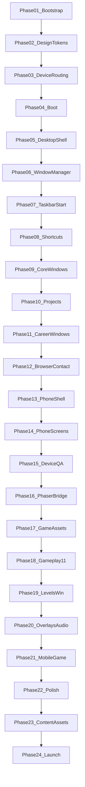

# FARHAN SAYED — PORTFOLIO V3
# MASTER EXECUTION PLAN
### "Farhan's World" — Retro OS Desktop + Nokia Phone Mobile + Platformer Game
**Domain:** farhanbuilds.in  
**Stack:** Next.js 15 · TypeScript · Tailwind · Framer Motion · Phaser.js 3 · Howler.js · EmailJS  
**Use:** Follow phases in order. Complete every sub-phase before marking a phase done. Pair with [`Farhan_Portfolio_V3_Master_Checklist.md`](./Farhan_Portfolio_V3_Master_Checklist.md) as the live checkpoint tracker.

> **Nostalgia override (2026-07-15):** Current chrome is too futuristic (dark cyan cyber OS + box-placeholder Mario). Visual direction is corrected in [`Farhan_Portfolio_Nostalgia_Fix_Plan.md`](./Farhan_Portfolio_Nostalgia_Fix_Plan.md) — **Windows XP Luna desktop** + **NES Super Mario Bros–accurate game art**. Treat that doc as the source of truth for look-and-feel until Tracks A/B are marked done.

---

## How to use this document

1. Execute **one phase at a time**, top to bottom.
2. Within a phase, finish **all sub-phases** (they are ordered).
3. A phase is **DONE** only when its **Exit Criteria** all pass.
4. Do not skip phases that other work depends on (Foundation → OS → Phone → Game → Polish → Launch).
5. Content polish (bios, screenshots, EmailJS keys) is **Phase 23** — UI can ship with placeholders first, as agreed.
6. Reference docs (concept detail, not execution order):
   - [`Farhan_Portfolio_V3_Complete_Plan.md`](./Farhan_Portfolio_V3_Complete_Plan.md) — product vision
   - [`Farhan_Portfolio_V3_Tech_And_Assets.md`](./Farhan_Portfolio_V3_Tech_And_Assets.md) — stack + assets
   - [`Farhan_Portfolio_V3_GameEngine.md`](./Farhan_Portfolio_V3_GameEngine.md) — Phaser architecture

---

## Project outcome (definition of done for the whole product)

When all 24 phases are complete, `farhanbuilds.in` must deliver:

| Surface | Experience |
|---------|------------|
| Desktop (≥1024px) | Boot → Farhan OS desktop → draggable windows → Start Menu → all portfolio apps → playable game as `.exe` |
| Mobile (<768px) | Nokia 3310 frame → keypad navigation → all portfolio screens → touch game |
| Tablet (768–1023px) | One-time choice: Desktop OS or Phone (remembered in `localStorage`) |
| Game | 3 levels + portfolio overlays + win/hire flow on both desktop and phone |
| Quality | Skippable boot, keyboard shortcuts, easter eggs, Lighthouse-aware performance, Vercel live on domain |

---

## Phase map (24 phases)

```
FOUNDATION          01–03
DESKTOP OS CORE     04–08
DESKTOP CONTENT     09–12
MOBILE + TABLET     13–15
GAME ENGINE         16–20
INTEGRATION         21–22
CONTENT + LAUNCH    23–24
```

---

# PHASE 01 — Project Bootstrap & Repository Structure

**Goal:** Create a runnable Next.js 15 app with the folder layout the rest of the plan assumes.

### Sub-phases

#### 01.1 — Initialize Next.js application
- Create Next.js 15 App Router project with TypeScript and Tailwind CSS 3.
- Enable React 19, strict TypeScript, ESLint (`next/core-web-vitals`).
- Confirm `npm run dev` and `npm run build` succeed on a blank home page.

#### 01.2 — Install runtime dependencies
- Install: `framer-motion`, `phaser`, `howler`, `@emailjs/browser`, `lucide-react`.
- Install dev: `@types/howler`, `@types/node`, `@types/react`, `@types/react-dom`, `@next/bundle-analyzer` (optional but planned).
- Do **not** add UI kits (no shadcn/MUI unless explicitly decided later).

#### 01.3 — Scaffold directory tree
Create (exact intent; names may be under `src/`):

```
public/
  game/sprites/  game/tilesets/  game/audio/  game/maps/
  images/projects/
  icons/
  resume.pdf          (placeholder OK)
src/
  app/                layout.tsx, page.tsx, globals.css
  components/
    desktop/          + windows/
    mobile/           + screens/
    game/             + phaser/ (scenes, objects, audio, bridge, data)
    shared/
  context/
  hooks/
  lib/                content loaders, constants
  content/            OR wire imports from data/content/
data/content/         existing JSON (keep as source of truth)
docs/                 plans (already present)
```

#### 01.4 — Wire content JSON into the app
- Expose a single content loader (`src/lib/content.ts` or similar) that imports/re-exports:
  - `site`, `about`, `projects`, `skills`, `experience`, `achievements`, `certifications`, `testimonials`, `volunteering`, `research`.
- Prefer importing from [`data/content/`](../data/content/) so content stays one place.
- Add TypeScript interfaces for each content shape (minimal, accurate).

#### 01.5 — Env + ignore hygiene
- Add `.env.example` with EmailJS placeholders (`NEXT_PUBLIC_EMAILJS_*`).
- Ensure `.env.local` is gitignored.
- Add `.gitignore` entries for `.next`, `node_modules`, env files.

### Deliverables
- Runnable Next app, deps installed, folders created, content importable.

### Exit criteria
- [ ] `dev` and `build` succeed
- [ ] Content loader returns real data from JSON files
- [ ] Env example committed; secrets not committed

---

# PHASE 02 — Design System, Tokens & Fonts

**Goal:** Lock visual language so every later component uses the same OS/phone/game tokens.

### Sub-phases

#### 02.1 — CSS custom properties (OS + Nokia)
In `globals.css`, define tokens from the tech plan, including at minimum:
- `--os-bg`, `--os-taskbar`, `--os-window`, `--os-window-body`
- `--os-title-active` / inactive, `--os-border`, `--os-button`, `--os-button-hover`
- `--cyan`, `--violet`, `--gold`, `--text`, `--text-muted`
- `--nokia-green`, `--nokia-body`, `--nokia-screen`

#### 02.2 — Google fonts via `next/font`
- `Space_Grotesk` → `--font-body`
- `JetBrains_Mono` → `--font-mono`
- `Press_Start_2P` → `--font-pixel`
- Apply variables on `<html>` / `<body>` in `layout.tsx`.

#### 02.3 — Tailwind theme extensions
- Map font families and brand colors to Tailwind config.
- Add keyframes: `scanlines`, `typewriter`/blink cursor, subtle wallpaper pan if used, Nokia screen glow.

#### 02.4 — Shared base styles
- Full-viewport app shell reset (overflow rules for OS vs phone).
- Selection colors, scrollbar styling inside windows (subtle, on-brand).
- Utility classes: `.font-pixel`, `.font-mono`, `.os-button`, `.scanlines`.

#### 02.5 — Metadata shell
- Root layout title/description from `site.json` meta fields.
- Open Graph tags (`og:title`, `og:image`, `og:description`), Twitter Card meta, and social share preview image (1200x630).
- Favicon placeholders (final favicons in Phase 22).

### Deliverables
- Tokenized globals, fonts loading without layout shift, Tailwind wired.

### Exit criteria
- [ ] Tokens present and used by at least one demo element
- [ ] All three fonts render
- [ ] Document title/meta show Farhan branding

---

# PHASE 03 — Device Detection, Routing & App Shell

**Goal:** Correct surface (desktop / mobile / tablet choice) on first paint and resize.

### Sub-phases

#### 03.1 — `useDeviceMode` hook
- Return `'desktop' | 'mobile' | 'tablet'`.
- Rules: `≥1024` desktop, `<768` mobile, else tablet.
- Listen to `resize`; SSR-safe default (no hydration flash of wrong UI — use mounted gate or CSS-first approach).

#### 03.2 — `useLocalStorage` hook
- Persist tablet preference: `farhan-device-preference` = `'desktop' | 'phone'`.
- Persist optional prefs later (mute, boot skip).

#### 03.3 — Root `page.tsx` orchestration
- Desktop → Desktop OS pipeline (boot then desktop).
- Mobile → Nokia phone pipeline.
- Tablet → `TabletChoice` unless preference exists.

#### 03.4 — `TabletChoice` shared component
- Two clear choices: Desktop View (Full OS) vs Mobile View (Nokia).
- Save choice; allow change later via a small setting if time allows.

#### 03.5 — Error Boundary Strategy
- React Error Boundary at the window level and game wrapper level to prevent full OS crashes from isolated failures.

#### 03.6 — Accessibility / UX baseline for routing
- Keyboard-focusable choice buttons.
- No horizontal page scroll on wrong shell.

### Deliverables
- Single entry page that routes correctly across breakpoints.

### Exit criteria
- [ ] Resize across breakpoints switches or remembers correctly
- [ ] Tablet choice persists across reload
- [ ] No flash of mobile shell on desktop after hydration

---

# PHASE 04 — Desktop Boot Sequence

**Goal:** Skippable branded BIOS → loading → login → desktop handoff.

### Sub-phases

#### 04.1 — `BootScreen` shell
- Full-viewport black/navy stage; `Press Start 2P` text.
- Sequence screens:
  1. BIOS lines (RAM / SIH Trophy / Coffee / Genius jokes)
  2. Progress bar “Starting Farhan OS…”
  3. Login card “Farhan Sayed — Click to Enter”
  4. Hand off to Desktop

#### 04.2 — Timing + skip
- Total ~10–15s if uninterrupted.
- “Click to skip” always visible.
- Skipable mid-sequence without leaving stuck state.

#### 04.3 — Startup chime
- Web Audio API synthesized startup beep (no copyrighted samples).
- Respect mute preference if already stored.

#### 04.4 — First-boot flags
- Mark `hasBooted` session/local flag so README auto-open can trigger once (Phase 09).

### Deliverables
- Working boot that always reaches Desktop.

### Exit criteria
- [ ] Skip works every time
- [ ] Login proceeds to desktop
- [ ] Chime fires once per boot (or silently if muted)

---

# PHASE 05 — Desktop Shell (Wallpaper, Icons, Layout)

**Goal:** Believable OS desktop before any windows exist.

### Sub-phases

#### 05.1 — `Desktop.tsx` shell
- Full viewport under taskbar area reserved.
- CSS grid/pixel wallpaper: dark navy + subtle cyan grid + `farhanbuilds.in` watermark.

#### 05.2 — Desktop icon set (SVG, 48×48 pixel style)
Build icons under `public/icons/` (or inline SVG components):
- Projects folder, Resume.pdf, About Me.txt, Achievements.zip
- Experience, Skills.exe, Farhan's World.exe, Browser.exe
- Contact.lnk, Recycle Bin, README.txt, System Info

#### 05.3 — Icon grid behavior
- Single-click select (highlight).
- Double-click open → dispatches `OPEN_WINDOW` (wired fully in Phase 06).
- Icon labels under icons; select/renaming not required.

#### 05.4 — Icon placement
- Default positions for desktop and small-laptop widths.
- Icons must not collide with taskbar.

### Deliverables
- Static desktop that looks like Farhan OS with all icons.

### Exit criteria
- [ ] All planned icons visible and labeled
- [ ] Double-click fires open action (even if stub window)

---

# PHASE 06 — Window Manager Core

**Goal:** Real multi-window OS behavior (open many, focus, Z-order).

### Sub-phases

#### 06.1 — `WindowContext` + `useReducer`
State fields per window: `id`, `title`, `component`, `isOpen`, `isMinimized`, `isMaximized`, `position`, `size`, `zIndex`, optional `payload`.

Actions: `OPEN`, `CLOSE`, `MINIMIZE`, `MAXIMIZE`, `RESTORE`, `FOCUS`, `MOVE`, `RESIZE`.

#### 06.2 — `Window.tsx` chrome
- Title bar, menu bar slot (optional per app), content area.
- Controls: minimize, maximize/restore, close.
- Active vs inactive title styling (gradient vs muted).
- Scale-in open / scale-out close via Framer Motion.

#### 06.3 — Dragging — `useDraggable`
- Drag from title bar; clamp so title bar remains reachable.
- Touch drag for tablet desktop mode.

#### 06.4 — Resizing — `useResizable`
- Edge/corner handles.
- Min size ~280×200 (enforce per window overrides if needed).

#### 06.5 — Focus & Z-index
- Click window → `FOCUS` bumps z-index.
- Only one active title style at a time.

### Deliverables
- Multiple stub windows open, move, resize, stack correctly.

### Exit criteria
- [ ] Two+ windows interact without stuck dragging
- [ ] Maximize fills usable area above taskbar
- [ ] Close/minimize leave state clean for reopen

---

# PHASE 07 — Taskbar, Start Menu & System Tray

**Goal:** Primary navigation for the OS without relying only on desktop icons.

### Sub-phases

#### 07.1 — `Taskbar.tsx`
- Height ~40px; dark XP-style bar.
- Left: Start button.
- Center/left: running app buttons (open → focus; minimized → restore).
- Right tray: volume (mute toggle), connectivity decorative icon, battery decorative, live clock.

#### 07.2 — `useClock`
- Real local time, update every second.
- Format e.g. `3:47 PM`.

#### 07.3 — `StartMenu.tsx`
Sections:
- Header: avatar placeholder + name + role from `site.json`
- Portfolio apps: Resume, Projects, Skills, Achievements, Experience, Contact
- Special: Farhan's World.exe, Browser
- Bottom: System Info, Shut Down

#### 07.4 — Start menu submenus
- Projects ▶ list of projects from JSON (open Projects window focused on that id).
- Skills / Achievements / Experience ▶ open respective windows (submenu optional if list is long — open window is minimum).

#### 07.5 — Shut Down flow
- Short goodbye animation / curtain.
- Optional “Restart” back to boot.
- Not a real power-off — playful only.

### Deliverables
- Fully navigable taskbar + start menu launching apps.

### Exit criteria
- [ ] Every Start item opens the correct window/component
- [ ] Running apps reflect open/minimized state
- [ ] Clock updates live; mute toggle works for later audio hooks

---

# PHASE 08 — Desktop Context Menu & Global Shortcuts

**Goal:** OS polish and power-user paths.

### Sub-phases

#### 08.1 — Right-click desktop context menu
Items: View, Sort By (visual only OK), Refresh, New (disabled or joke), About Farhan, Hire Farhan, Properties.
- Hire Farhan → Contact window.
- About Farhan → About window.

#### 08.2 — Keyboard shortcuts
- `F1` Start Menu
- `F2` Launch game window
- `Esc` Close focused window (or close Start Menu / context menu first)
- `?` Help / README

#### 08.3 — Focus traps
- Esc / click-away closes Start Menu and context menu.
- Menus never block taskbar permanently.

### Deliverables
- Context menu + shortcuts documented in README content.

### Exit criteria
- [ ] Shortcuts work with an open window focused
- [ ] Context menu opens Contact and About

---

# PHASE 09 — Core Content Windows (README, About, System Info, Recycle Bin)

**Goal:** First real portfolio reading experience inside OS windows.

### Sub-phases

#### 09.1 — README.txt (Notepad)
- Monospace notepad chrome.
- Welcome copy, quick start, keyboard shortcuts, contact pointers.
- Auto-open once after first successful boot.

#### 09.2 — About Me.txt
- Render from `about.json` + `site.json` (bio, socials, timeline).
- Notepad aesthetic; links clickable (GitHub, LinkedIn, email).

#### 09.3 — System Info modal/window
- Fun “About This PC” stats (projects count, skills count, certs count, uptime joke).
- Counts derived from JSON lengths where possible.

#### 09.4 — Recycle Bin easter egg
- Deleted files list: impostor syndrome, tutorial hell, giving up, etc.
- At least one “In Progress…” gag.

### Deliverables
- Four working windows with real (or plan-default) copy.

### Exit criteria
- [ ] README auto-opens once per first visit preference
- [ ] About shows live content data
- [ ] Recycle Bin and System Info open from icons/Start

---

# PHASE 10 — Projects Explorer Window

**Goal:** File-explorer style project browser for all 11 projects.

### Sub-phases

#### 10.1 — Two-panel File Explorer UI
- Left: folder tree by categories (SIH / International / AI / Civic / E-commerce / Healthcare / Robotics / Government / Campus — map from project data or hard-map by id).
- Right: project detail panel.

#### 10.2 — Project detail view
- Title, tagline, role, award badge, short description.
- Problem / solution / impact when present; graceful omit when missing.
- Tech stack chips.
- GitHub / Live Demo buttons (disabled or hidden when null).

#### 10.3 — Project image placeholders
- Implement `ProjectImage` with gradient placeholder on missing file (`onError`).
- Use project-specific accent colors.

#### 10.4 — Deep-link from Start submenu / icons
- Opening with `projectId` selects that project immediately.

### Deliverables
- Full Projects window bound to `projects.json`.

### Exit criteria
- [ ] Every project selectable
- [ ] Featured vs archived both reachable
- [ ] Missing images never break layout

---

# PHASE 11 — Skills, Experience, Achievements, Certifications, Resume

**Goal:** Remaining career-content apps.

### Sub-phases

#### 11.1 — Skills.exe
- Tab or section per `categoryName` from `skills.json`.
- Grid of skills; pixel/icon optional; readable first.

#### 11.2 — Experience timeline app
- Vertical timeline from `experience.json`.
- Expand row for full description.

#### 11.3 — Achievements “zip” window
- Brief extracting animation → grid of `.award` cards.
- Click → certificate-style detail popup (title, year, place, description).

#### 11.4 — Certifications view
- Either separate window or tab inside Achievements/System.
- List from `certifications.json` with external verify links.
- UI should not dump all 37 as equal weight (group or “featured first” when flags exist; until then sort by date desc and collapsible “Show all”).

#### 11.5 — Resume.pdf window
- iframe or PDF object viewer for `/resume.pdf`.
- Download control in title bar / toolbar.
- Placeholder page if PDF missing.

#### 11.6 — Optional: Volunteering + Testimonials + Research
- Lightweight windows or subsections inside About/Experience.
- Safe to stub if Phase 23 will refine content — but navigation entries must not 404.

### Deliverables
- All career windows openable and content-backed.

### Exit criteria
- [ ] Skills / Experience / Achievements / Resume launch from desktop + Start
- [ ] Cert links open in new tab
- [ ] Empty PDF shows graceful empty state

---

# PHASE 12 — Browser.exe, Contact & Email Integration

**Goal:** Playful browser + real contact path for recruiters.

### Sub-phases

#### 12.1 — Fake Browser window
- Chrome: back/forward (history stack), address bar, refresh.
- Default home: retro “farhanbuilds.in” landing inside the fake browser.

#### 12.2 — Internal URL routes (same window)
- `farhanbuilds.in` / `farhanbuilds.in/projects` / `farhanbuilds.in/contact` / `farhanbuilds.in/blog`
- Blog = fun facts, not a CMS.
- Typing `github.com/FarhanSayed16` opens real GitHub in a new tab (or confirms then opens).

#### 12.3 — Contact.lnk (Outlook-style compose)
- Fields: From (editable), To (fixed), Subject, Body.
- Attach Resume decorative button.
- Send Message primary CTA.

#### 12.4 — EmailJS wiring
- If env vars present → send via EmailJS.
- If missing → clear “configure EmailJS” / mailto fallback — **do not block build**.

#### 12.5 — Validation & success states
- Required subject/body.
- Success toast inside window; error message on failure.

### Deliverables
- Browser playground + working contact path (live or fallback).

### Exit criteria
- [ ] Fake URLs switch content
- [ ] Contact send path tested with and without env keys
- [ ] Mailto fallback works when EmailJS unset

---

# PHASE 13 — Nokia Phone Frame & Navigation Core

**Goal:** Mobile portfolio surface feels like a physical Nokia 3310.

### Sub-phases

#### 13.1 — `PhoneFrame` visual
- SVG/CSS body, bezel, speaker, soft keys, D-pad, 12-key pad, Nokia branding.
- Centered on mobile viewport with safe margins.

#### 13.2 — `PhoneScreen` region
- Screen overlay div for real content.
- Green monochrome tint + scanlines + glow.

#### 13.3 — `PhoneContext`
- `currentScreen`, `screenHistory`, `selectedIndex`.
- Actions: navigate, back, move cursor, select.

#### 13.4 — `PhoneKeypad` mapping
- D-pad up/down/left/right, SELECT, soft keys Back/Options.
- Number keys jump to menu items where applicable.
- `*` mute toggle; `#` show-all where applicable.

#### 13.5 — Phone boot screen
- Short FARHAN OS / Nokia Edition loading bar → Main Menu.

### Deliverables
- Navigable empty phone shell with boot + menu framework.

### Exit criteria
- [ ] Hardware buttons drive screen state
- [ ] Back pops history correctly
- [ ] Looks intentional on real phone widths (375–430px)

---

# PHASE 14 — Nokia Portfolio Screens

**Goal:** Full mobile content parity for core portfolio paths.

### Sub-phases

#### 14.1 — Main Menu
- Items: Profile, Projects, Skills, Achievements, Contact, Play Game (0).
- Highlight cursor; number shortcuts.

#### 14.2 — Profile screen
- Name, city, education snapshot, short bio line(s), more pagination if needed.

#### 14.3 — Projects list + detail
- Scrollable list with award markers.
- Detail: tagline, tech, short description.

#### 14.4 — Skills screen
- Category browse with left/right.

#### 14.5 — Achievements screen
- Compact list; detail on select.

#### 14.6 — Contact screen
- Email, GitHub, LinkedIn; Call/open email action.

#### 14.7 — Game launcher screen
- Title, one-liner, High Score (localStorage), Start Game → Phase 21 mount.

### Deliverables
- Complete phone content navigation without the game canvas.

### Exit criteria
- [ ] Every menu path reachable and backable
- [ ] Content matches desktop JSON sources
- [ ] No unreadable overflow without scroll via D-pad

---

# PHASE 15 — Tablet Choice Polish & Cross-Surface QA Gate

**Goal:** Stabilize non-game product across devices before Phaser work.

### Sub-phases

#### 15.1 — Tablet choice UX polish
- Clear recommended labels; remember preference; optional reset.

#### 15.2 — Desktop-on-tablet pass
- Touch drag windows; hit targets ≥44px for Start/icons.

#### 15.3 — Mobile landscape handling
- Phone frame scales; keypad usable; no clipped SELECT.

#### 15.4 — Checkpoint demo
- Record a short manual test script: boot OS → open 5 windows → phone menu tour.

### Deliverables
- Device matrix signed off for OS + Phone (pre-game).

### Exit criteria
- [ ] Desktop, mobile, tablet paths validated manually
- [ ] No critical layout bugs on Chrome mobile + desktop

---

# PHASE 16 — Phaser Bootstrap, Bridge & Game Wrapper

**Goal:** Mount/destroy Phaser safely from React with a one-way event bridge.

### Sub-phases

#### 16.1 — Dynamic import strategy
- Phaser only loads when game window/screen opens (keep main bundle lean).

#### 16.2 — `GameWrapper.tsx`
- Props: platform, container size, onClose.
- Mount canvas; cleanup `game.destroy(true)` on unmount.

#### 16.3 — `GameBridge` singleton
- Phaser → React only: `showOverlay`, `hideOverlay`, game over, win.
- React → Phaser resume via game events (`overlay-dismissed`, `play-again`, `mobile-input`).

#### 16.4 — `createGame` factory (`phaser/main.ts`)
- Config: 768×480, `pixelArt: true`, Arcade physics gravity ~980, Scale FIT.
- Scene list stubbed: Boot → Preload → Level stubs → Win.

#### 16.5 — Desktop + Phone mounts
- Desktop: open as Farhan's World.exe window (~768×480).
- Mobile: mount inside phone screen with smaller CSS size; same internal resolution.

### Deliverables
- Blank/preload Phaser runs inside OS window and phone without leaks.

### Exit criteria
- [ ] Opening/closing game twice does not duplicate WebGL contexts
- [ ] Phaser absent from initial Lighthouse main bundle (spot-check)

---

# PHASE 17 — Game Assets Pipeline (Sprites, Maps, BGM)

**Goal:** All binary/code assets required for playable levels are in `public/game`.

### Sub-phases

#### 17.1 — Sprites decision lock (record in checklist)
- Default execution path for this master plan: **original Farhan-branded platformer sprites** (Mario-*inspired* feel, custom art) OR downloaded fan sprites if explicitly approved later.
- Whatever is chosen, document exact filenames under `/public/game/sprites/`.

#### 17.2 — Acquire / generate sprite sheets
- Player, enemies, items, tiles, HUD elements.
- Note `frameWidth` / `frameHeight` for Phaser.

#### 17.3 — Build tilemaps in Tiled
- `level_1_1.json`, `level_1_2.json`, `level_1_3.json`.
- Layers: Background, Ground (collides), Objects (spawns, Q-blocks, flag/axe, etc.).
- Object properties: `portfolioIndex`, `contains`, enemy `type`, `MarioSpawn`, etc.

#### 17.4 — CC0 BGM from opengameart (or equivalent)
- overworld, underground, castle, victory, gameover — `.ogg` + `.mp3` fallbacks.

#### 17.5 — Placeholder assets if finals pending
- Colored rectangles / simple shapes allowed to unblock coding; swap files without API changes.

### Deliverables
- Maps + sprites + BGM paths loadable by PreloadScene.

### Exit criteria
- [ ] PreloadScene progresses to 100% without 404s
- [ ] Filenames match code keys exactly

---

# PHASE 18 — Core Gameplay (Player, Level 1-1, Enemies, Items)

**Goal:** Authentic-feeling platformer loop on Overworld.

### Sub-phases

#### 18.1 — `BootScene` + `PreloadScene`
- Loading bar; animation registrations (walk, jump, die, goomba, coin, Q-block).

#### 18.2 — `BaseLevel` architecture
- Shared HUD, timer, lives, score, collisions, input, overlay pause/resume.

#### 18.3 — Player movement
- Left/right, variable jump, run modifier, camera follow, fall death.

#### 18.4 — Level 1-1
- Ground collision, pipes/bricks as designed, flagpole → level complete.

#### 18.5 — Enemies + items
- At least Goomba stomp/hit; coins; question blocks spawning mushroom/star/coin; power-up basic state (small/super).

#### 18.6 — Desktop input
- Arrows/WASD, Space/Up jump, Z/X run/fire stub, Esc exits to OS (via React close).

### Deliverables
- Playable Level 1-1 with lives/score/timer.

### Exit criteria
- [ ] Can finish 1-1 without softlocks
- [ ] Death and retry work
- [ ] Physics feel “platformer-correct” (tunable)

---

# PHASE 19 — Levels 1-2, 1-3 (Boss), Win Flow

**Goal:** Complete World 1 loop ending in hire CTA.

### Sub-phases

#### 19.1 — Level 1-2 Underground
- Distinct BGM/palette; warp zone trigger; flag/warp to 1-3.

#### 19.2 — Level 1-3 Castle
- Lava hazards, Bowser spawn, axe overlap, bridge collapse sequence.

#### 19.3 — Boss defeat → win payload
- Emit major overlay; then `WinScene`.

#### 19.4 — `WinScene` + Play Again
- Victory BGM; Play Again resets to 1-1 and overlay trigger state.
- Hire Farhan routes to Contact (desktop window / phone screen).

#### 19.5 — Game Over overlay
- Lives = 0 → message + retry.

### Deliverables
- Full 3-level campaign completable.

### Exit criteria
- [ ] 1-1 → 1-2 → 1-3 → Win path tested end-to-end
- [ ] Hire CTA opens Contact on both surfaces
- [ ] Play Again resets progress cleanly

---

# PHASE 20 — Portfolio Overlay System + Game Audio

**Goal:** Game teaches Farhan’s story; audio is copyright-safe.

### Sub-phases

#### 20.1 — `portfolioData.ts`
- Coin facts, Q-block skills, mushroom projects, star achievements, level-clear, Bowser win copy.
- Draft from Complete Plan §B3; content wording refinable in Phase 23.

#### 20.2 — `GameOverlay.tsx`
- Types: fact toast, skill/project cards, achievement banner, level-clear, game-over, win.
- Framer Motion enter/exit; auto-dismiss vs manual; any-key dismiss where specified.

#### 20.3 — Wire BaseLevel triggers
- Coin milestones, Q-block hits, mushroom/star/fireflower, warp, flag, death, boss.

#### 20.4 — `SFXSynth.ts` (Web Audio API)
- jump, coin, block, stomp, powerup, die, flagpole, gameover, boss, etc.

#### 20.5 — Howler/Phaser BGM
- Loop per level; pause on overlay; mute sync with OS tray / phone `*`.

#### 20.6 — HUD easter egg
- Score > 9999 → name flickers toward “HIRE ME”.

### Deliverables
- Overlay+audio complete for all planned triggers.

### Exit criteria
- [ ] Every overlay type appears at least once in a test play
- [ ] Mute stops SFX+BGM
- [ ] No Nintendo audio files in repo

---

# PHASE 21 — Mobile Game Controls & Dual-Surface Game QA

**Goal:** Same engine, phone-friendly controls and overlays.

### Sub-phases

#### 21.1 — On-screen D-pad / A / B when game active on phone
- Emit `mobile-input` to Phaser via bridge.

#### 21.2 — Overlay sizing for small screen
- Readable Press Start text; buttons tappable.

#### 21.3 — Pause / exit to phone menu
- Soft key or menu exits without freezing PhoneContext.

#### 21.4 — Performance pass on mid-tier phones
- Cap simultaneous enemies if needed (`ponytail` note if deliberate).

#### 21.5 — Desktop ↔ mobile parity checklist
- Overlays, win hire path, mute, restart.

### Deliverables
- Touch-playable game inside Nokia screen.

### Exit criteria
- [ ] Complete at least Level 1-1 on a real phone
- [ ] Exit returns to phone menu cleanly

---

# PHASE 22 — Visual Polish, Icons, Favicons, Motion Pass

**Goal:** Make the product feel finished before content/assets perfection.

### Sub-phases

#### 22.1 — Final pixel icons + favicon set
- `favicon.ico`, `favicon.svg`, `apple-touch-icon.png`.

#### 22.2 — Framer Motion consistency
- Window open/close/minimize, Start Menu, phone screen transitions, overlays.

#### 22.3 — Micro-interactions
- Icon hover shimmer/wobble (game + recycle), button pressed states, boot cursor blink.

#### 22.4 — Empty / loading / error UI
- Missing resume, missing screenshots, EmailJS failure — all intentional.

#### 22.5 — Easter eggs review
- Recycle Bin, HUD HIRE ME, right-click Hire, optional Konami or desktop secret (only if already cheap to add).

### Deliverables
- Polish pass complete across OS + Phone + Game chrome.

### Exit criteria
- [ ] No placeholder “lorem” in UI chrome
- [ ] Favicons show in browser tab
- [ ] Motion does not cause inaccessible focus loss

---

# PHASE 23 — Content Enrichment & Real Assets (Deferred OK)

**Goal:** Replace placeholders with Farhan’s final personal assets and copy. **Can run partly in parallel after Phase 12, but must finish before public launch marketing.**

### Sub-phases

#### 23.1 — Canonical identity pass
- Unify email, education line, taglines across `site.json`, About, phone Profile, meta.

#### 23.2 — Projects completeness
- Fill missing problem/solution/impact; repo/demo URLs where public.
- Drop real screenshots into `/public/images/projects/` with agreed filenames.

#### 23.3 — Profile photo + resume PDF
- `/public/images/farhan.jpg` (or path in site.json), final `/public/resume.pdf`.

#### 23.4 — Certifications curation
- Feature flags or shortlist for UI; keep full list accessible.

#### 23.5 — Testimonials policy
- Real quotes only; otherwise hide section.

#### 23.6 — `portfolioData.ts` wording approval
- Farhan reviews coin facts, project cards, Bowser win copy.

#### 23.7 — EmailJS production keys
- `.env.local` + Vercel env; send a real test email.

### Deliverables
- Production content + assets + email.

### Exit criteria
- [ ] No critical content contradictions on public pages
- [ ] Contact email arrives
- [ ] Featured projects show real screenshots (or explicit accept placeholders)

---

# PHASE 24 — Deployment, Domain, Final QA & Launch

**Goal:** Live on farhanbuilds.in with a signed launch checklist.

### Sub-phases

#### 24.1 — Vercel project
- Connect repo; framework Next.js; production branch.

#### 24.2 — Domain DNS
- Point `farhanbuilds.in` (and `www` if used) to Vercel.
- HTTPS confirm.

#### 24.3 — Production env
- EmailJS keys in Vercel; verify Contact in production.

#### 24.4 — Cross-browser QA
- Chrome, Firefox, Edge, Safari (desktop + iOS Safari).

#### 24.5 — Performance audit
- Lighthouse on marketing surfaces; confirm Phaser not in initial JS.
- Fix regressions that block usable first load.

#### 24.6 — Full regression script
- Boot → 8+ windows → phone tour → play 1-1 → win hire path (or overlay hire) → Contact.
- Shortcuts, mute, tablet choice reset.

#### 24.7 — Launch
- Announce-ready build; tag release if using git tags.
- Post-launch: monitor Contact failures / 404 assets.

### Deliverables
- Production site live; checklist fully checked in companion doc.

### Exit criteria
- [ ] HTTPS site resolves on farhanbuilds.in
- [ ] Desktop + mobile + game smoke tests pass on production
- [ ] Master Checklist Phase 24 marked complete

---

## Dependency graph (simplified)



Note: Phase 23 content work may start as soon as Phase 01 content loader exists, but **launch (24)** requires **23** complete enough for public credibility.

---

## Built-in acceptance standard (every phase)

Each phase must leave the repo:
1. **Runnable** (`dev` works for completed surfaces).
2. **Typed** (no new unexplained `any` in public APIs).
3. **Placeholder-safe** (missing assets don’t crash).
4. **Documented in checklist** (tick companion file the same day).

---

## Out of scope (explicit — do not build unless requested)

- Real Windows emulator / filesystem persistence beyond window positions prefs
- Multiplayer, accounts, CMS admin
- More than World 1 (3 levels)
- Native mobile app stores
- Nintendo commercial redistribution (keep non-commercial portfolio; prefer custom sprites)

---

*Master Execution Plan — Portfolio V3 “Farhan's World”*  
*farhanbuilds.in · Farhan Sayed · Mumbai*  
*Document version 1.0 — 24 phases · Use with Master Checklist*
